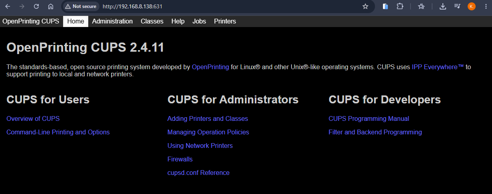

# 🖨️ CyberPrint-Server (Alpine + CUPS)

**CyberPrint-Server** is a lightweight **Alpine Linux + CUPS** virtual appliance that provides a ready-to-use print server for cybersecurity and IT-training labs.  
It’s ideal for demonstrating secure printing, service hardening, and defensive logging within authorised penetration-testing environments.

---
---

## 🔗 Download
➡️ **[Download CyberPrint-Server.ova](https://sourceforge.net/projects/cyberprint/files/)**  


## Screenshot



---
---

## 🧠 Access & Usage

### 🌐 Web Interface
`http://IP:631`  
→ View the printing management home page and job queues

### 🖨️ Installed Printer
`http://IP:631/printers/CyberPrint`  
→ Add as a **Generic Text-Only** network printer on your computer  
 (or deploy via **Group Policy** in **Active Directory**)

### ⚠️ Notes
- Replace `IP` with the IP displayed on the VM console banner  
  or check via `ip addr show`.  
- Use only in controlled, authorised lab environments.  

### 🔑 Credentials
`root / hullu`  
(These credentials can also be used for printing management.)

---
---

## ✨ Features
- Pre-installed **OpenPrinting CUPS** with the `CyberPrint` Generic Text-Only printer  
- Web interface available on port 631 (HTTP)  
- SSH/SFTP access (`ssh root@<IP>` / password `hullu`) port `22`
- Dynamic login banner showing the current IP and printer URLs  
- Persistent configuration using Alpine’s **lbu overlay system**  
- Lightweight footprint — perfect for teaching and classroom labs  
- Ready for future **Active Directory** and **TLS/IPPS** integration  

---
---

## ⚙️ Import Instructions

### VMware Workstation / Fusion
1. Open **VMware Workstation**.  
2. Select **File → Open**, choose `CyberPrint-Server.ova`.  
3. Accept defaults or pick a custom VM name/location.  
4. Start the VM — the console shows the IP and access URLs.

### VirtualBox
1. Open **VirtualBox**.  
2. Choose **File → Import Appliance**, select the OVA file.  
3. Accept the default settings and import.  
4. Start the VM — the login banner will display the active IP.


---
---
## 🌐 Networking

By default, the CyberPrint-Server VM uses **DHCP**, automatically obtaining an IP address at startup.  
The current IP address is displayed on the console banner and can also be viewed with:
```
ip addr show eth0 
```
### To switch to a static IP:
```
sudo nano /etc/network/interfaces
```
Replace the content for eth0:
```
auto eth0
iface eth0 inet static
    address 196.168.0.5
    netmask 255.255.255.0
    gateway 196.168.0.1
    dns-nameservers 196.168.0.1
```
Apply changes:
```
rc-service networking restart
```

### To revert back to DHCP:
Replace the content for eth0:
```
auto eth0
iface eth0 inet dhcp
```
Apply changes:

```
rc-service networking restart
```

---
---

## 📜 License
MIT © 2026 Kaled Aljebur
